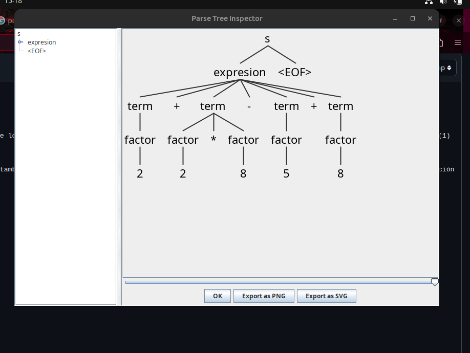
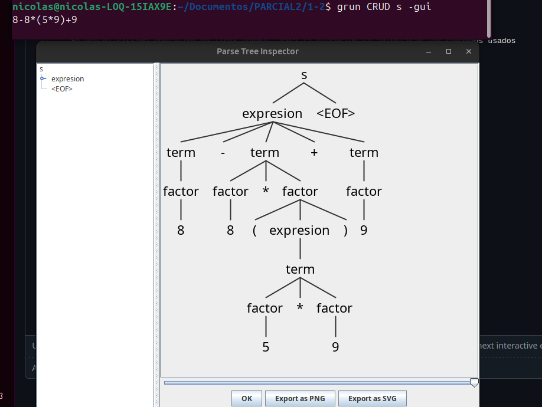
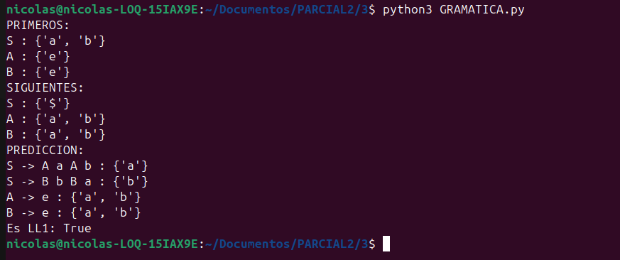
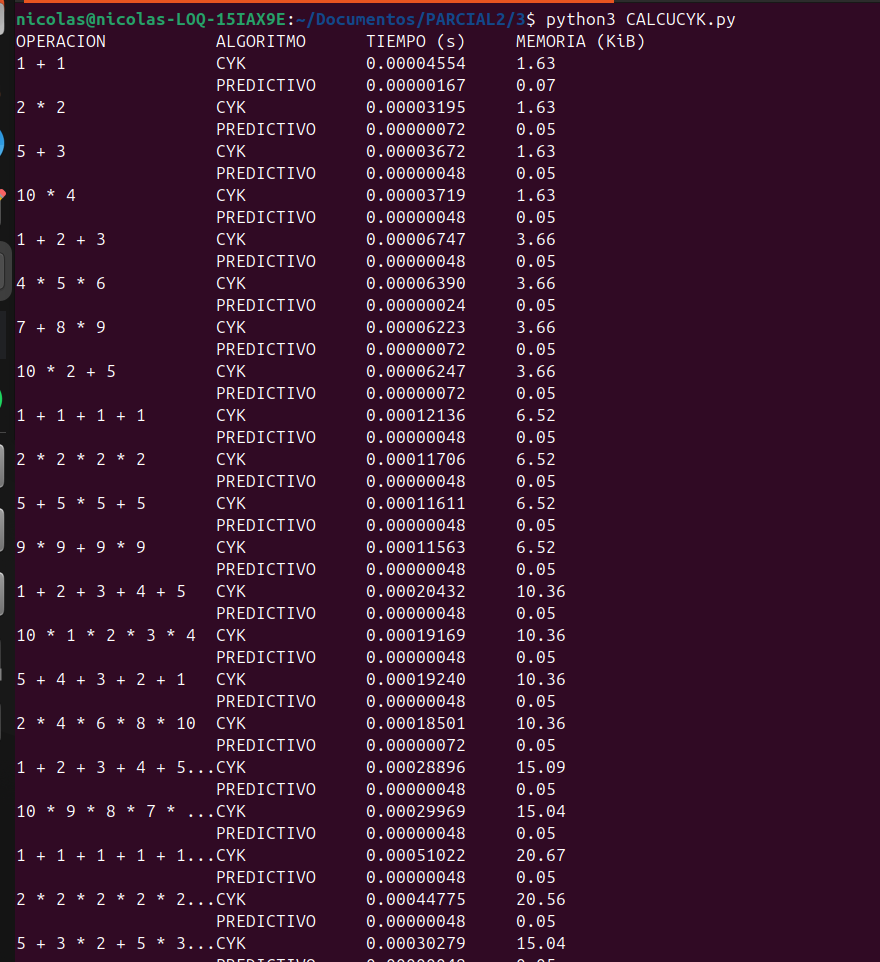
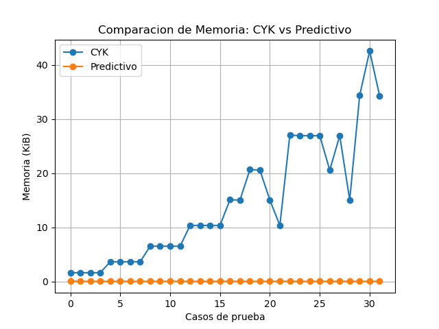
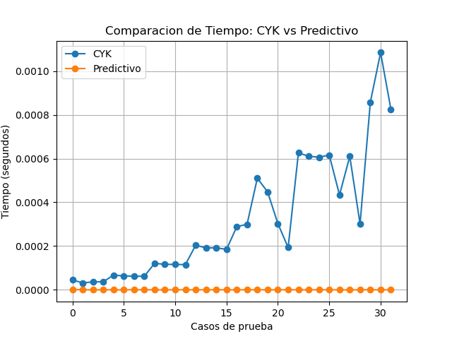

# PARCIAL2

**INTRODUCCION**

Este trabajo presenta el desarrollo de diferentes analizadores sintácticos para resolver problemas de lógica y aritmética. Se comparan dos enfoques fundamentales: el análisis descendente mediante gramáticas LL(1) y herramientas como ANTLR, y el análisis ascendente utilizando el algoritmo CYK y Yacc/Bison.

A través de implementaciones en Python y C, se evalúa no solo la funcionalidad de cada parser, sino también su eficiencia en tiempo y memoria. El objetivo es demostrar por qué los modelos predictivos son la opción estándar en el desarrollo de compiladores frente a métodos de búsqueda exhaustiva.

**PUNTO 1 Y 2 **

Se uso el sistema operativo de linux ubunut, para la ejecucion se adjuntaran los comandos usados

**Paso 1**

GENERAR EL PERSER 

```bash
  antlr4 CRUD.g4
```

**Paso 2**

COMPILAR LOS ARCHIVOS GENERADOS 

```bash
javac *.java
```

**Paso 3**

Ver el arbol de derivacion 

```bash
grun CRUD s -gui
```

**PUNTO3**

**DESCRIPCION DEL CODIGO**

El código define una gramática en ANTLR que permite interpretar diferentes operaciones tipo CRUD. Se establecen reglas para cada tipo de instrucción, como insertar, buscar, actualizar y eliminar, además de permitir listas de valores y condiciones.

También incluye reglas para manejar expresiones aritméticas, organizadas en niveles (expresión, término y factor) para respetar la precedencia de operadores. Finalmente, se definen los tokens básicos como identificadores, valores y operadores, junto con reglas para ignorar espacios en blanco.


**ANALISIS**

En este punto se creó una gramática en ANTLR para manejar operaciones tipo CRUD como insertar, buscar, actualizar y eliminar. También se permitió el uso de expresiones aritméticas dentro de los valores, respetando la precedencia de operadores.

Se probaron diferentes entradas y se generaron árboles de derivación para verificar que la gramática interpretara correctamente las instrucciones. Con esto se comprobó que el analizador funciona bien y solo acepta estructuras válidas.

**EJECUCION EN CONSOLA Y ARBOLES DE DERIVACION**

EJEMPLO 1



EJEMPLO 2 



**PUNTO 3**

**Como ejecutarlo**

se uso python

```bash
python3 GRAMATICA.py
```

**DESCRIPCION DEL CODIGO**

Este código implementa el cálculo de los conjuntos PRIMEROS, SIGUIENTES y PREDICCIÓN para una gramática dada, con el fin de verificar si es LL(1). Primero, se define la gramática usando un diccionario. Luego, se calculan los PRIMEROS identificando los símbolos con los que pueden iniciar las producciones, teniendo en cuenta la presencia de epsilon (representado como "e"). Después, se calculan los SIGUIENTES, que indican qué símbolos pueden aparecer después de cada no terminal. Con estos dos conjuntos, se construyen los conjuntos de PREDICCIÓN para cada producción, los cuales permiten determinar si la gramática puede analizarse de manera predictiva. Finalmente, se verifica si la gramática es LL(1), comprobando que no existan conflictos entre los conjuntos de predicción.

**ANALISIS DEL CODIGO**

A partir de la ejecución del programa, se obtuvieron los conjuntos PRIMEROS, SIGUIENTES y PREDICCIÓN de la gramática. Se observa que el símbolo inicial S puede comenzar con los terminales "a" o "b", mientras que los no terminales A y B generan epsilon (representado como "e"). En los conjuntos SIGUIENTES, se evidencia que A y B pueden ir seguidos de "a" o "b", lo cual coincide con su uso dentro de las producciones de S. Los conjuntos de PREDICCIÓN muestran que cada producción de S tiene símbolos de entrada distintos ("a" y "b"), evitando conflictos. Además, aunque A y B derivan en epsilon, sus conjuntos de predicción están bien definidos. Finalmente, el programa determina que la gramática es LL(1), ya que no existen intersecciones entre los conjuntos de predicción de las producciones de un mismo no terminal, lo que garantiza que puede ser analizada de forma predictiva sin ambigüedades.

**EJECUCION EN CONSOLA**



**PUNTO 4**


**Como ejecutarlo**

```bash
python3 CALCUCYK.py
```

**DESCRIPCION DEL CODIGO**

Este código implementa una comparación entre el algoritmo CYK y un parser predictivo utilizando expresiones aritméticas como entrada. Para cada caso, se mide el tiempo de ejecución y el consumo de memoria de ambos algoritmos.

Los resultados se muestran en una tabla organizada y además se almacenan para generar gráficas que permiten visualizar el rendimiento de cada método. Con esto, se puede observar claramente que el algoritmo CYK tiene un mayor costo computacional en comparación con el parser predictivo.

**ANALISIS DEL CODIGO**

A partir de los resultados obtenidos, se observa que el algoritmo CYK presenta tiempos de ejecución y consumo de memoria significativamente mayores en comparación con el parser predictivo. Esto se debe a que CYK tiene una complejidad cúbica O(n³), ya que evalúa múltiples combinaciones de subcadenas. Por otro lado, el parser predictivo muestra un comportamiento mucho más eficiente, con tiempos muy bajos y un uso de memoria casi constante, debido a su complejidad lineal O(n). En las gráficas se evidencia que, a medida que aumentan los casos de prueba o la longitud de las expresiones, el rendimiento del CYK empeora, mientras que el parser predictivo se mantiene estable. En conclusión, aunque CYK es más general y permite trabajar con más tipos de gramáticas, el parser predictivo resulta más adecuado para aplicaciones prácticas por su eficiencia.

**EJECUCION EN CONSOLA Y GRAFICAS**

EJECUCION TERMINAL 



GRAFICA DE MEMORIA USADA 



GRAFICA DE TIEMPO 


